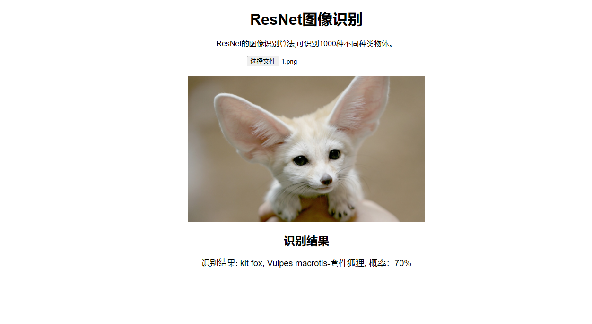

# ResNet-Web-API
基于ResNet预训练算法开发的图像识别网页和AP应用。一键运行即可实现网页和API接口，方便自娱自乐和第三方服务使用，享受科技带来的乐趣。
## ResNet预训练模型介绍
ResNet（Residual Network）是一种深度学习网络，通过引入残差连接来解决深层网络训练过程中的梯度弥散问题，使得深层模型更容易训练，并且验证了随着网络层次的加深模型可以获得更好的性能。

在ResNet模型中，引入了直连通路，使深层模型可以保持原始数据信息且训练过程不容易梯度弥散。直连通路与卷积层进行合并时采用元素点相加的方式，而不是直接拼接（Concatenate），使模型在训练过程中只需要拟合不同层网络中输出值与输入值的残差值，而无需直接拟合网络输出值，降低了模型训练难度。

ResNet101预训练模型接受输入三通道输入，神经网络层数为101层，输入3\*224\*224 输出为1\*1000。
# 1.效果展示
## 1.1网页端效果
 

## 1.2API效果
URL: http://localhost:8000/api/preidct

## 2.快速开始
环境要求
1. python3.6以上
2. pip
3. 无需GPU 

### 2.1下载代码
```bash
git clone https://github.com/sunchongwei/ResNet-Web-API.git
```
### 2.2安装依赖
```bash 
pip install -r requirements.txt
```
### 2.3运行算法
```bash
python main.py
```